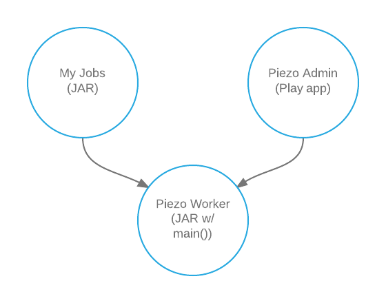

Piezo
=====

Piezo is a system for operating and managing a [Quartz Scheduler](http://quartz-scheduler.org/documentation/quartz-2.2.x/quick-start) cluster. The first component is the Worker, which is a driver or main class for running a Quartz instance. The second is the Admin, which is a web interface for administrating a Quartz cluster, including managing which jobs run, and viewing a history of what processing the cluster has completed. The third project in the diagram below is your library containing the actual jobs to run.



## Worker
Worker is a process that runs a [Quartz Scheduler](http://quartz-scheduler.org/documentation/quartz-2.2.x/quick-start) instance.

Worker provides a java main() function for running a quartz scheduler as a daemon. It writes a PID file for help with start and stop (e.g. init.d) scripts. It handles the runtime shutdown event and graceful exits when it receives a shutdown signal (`ctrl-c/SIGINT`).

Worker also expands the set of tables that quartz uses with additional tables to track historical job execution data.

### Setup

#### Fast way

1. Run the [sql setup script](worker/src/main/resources/run-sql.sh)
2. Modify the included [sample quartz.properties](/worker/src/main/resources/quartz.properties) to point to your database (see [Quartz scheduler library config file](http://quartz-scheduler.org/documentation/quartz-2.2.x/configuration/)).
3. Run Piezo as specified in [Running](#running).

#### Full setup
1. Create a database. Piezo includes a [sample database creation script](worker/src/main/resources/run_me_first.sql)
2. Create the standard [job store](http://quartz-scheduler.org/documentation/quartz-2.2.x/tutorials/tutorial-lesson-09) using ONE of the following methods:
    1. Use the sample scripts included in [worker/src/main/resources](worker/src/main/resources) that start with quartz (easiest method).
    2. See the [quartz job store documentation](http://quartz-scheduler.org/documentation/quartz-2.2.x/tutorials/tutorial-lesson-09) for the complete set of options.
    3. From the documentation:
        "JDBCJobStore works with nearly any database, it has been used widely with Oracle, PostgreSQL, MySQL, MS SQLServer, HSQLDB, and DB2. To use JDBCJobStore, you must first create a set of database tables for Quartz to use. You can find table-creation SQL scripts in the 'docs/dbTables' directory of the Quartz distribution. If there is not already a script for your database type, just look at one of the existing ones, and modify it in any way necessary for your DB."
3. Create the Piezo job history tables. Use SQL scripts beginning with "piezo" in [worker/src/main/resources](/worker/src/main/resources).
4. Modify the included [sample quartz.properties](/worker/src/test/resources/quartz_test.properties) to point to your database (see [Quartz scheduler library config file](http://quartz-scheduler.org/documentation/quartz-2.2.x/configuration/)).
5. Run Piezo as specified in [Running](#running).

### Building
You must have [sbt](http://www.scala-sbt.org/) 0.13.

`sbt worker/compile` compiles sources.

`sbt worker/packageBin` creates a JAR.

### Configuration
#### JVM properties
* `org.quartz.properties` - [Quartz scheduler library config file](http://quartz-scheduler.org/documentation/quartz-2.2.x/configuration/)
* `pidfile.path` - path to file where PID should be written on startup

### Running

When developing

```sh
sbt worker/run
```

This uses the quartz.properties file at the repo root and runs a heatbeat job.

To use to run jobs add `com.lucidchart:piezo-worker:<version>` as a dependency to your project, and then run the
com.lucidchart.piezo.Worker class. For example,

```
java  -Dorg.quartz.properties=<path to quartz properties> -Dpidfile.path=<path to pid file> -cp <classpath> com.lucidchart.piezo.Worker
```

### Stats
Worker reports statistics to a [StatsD](https://github.com/etsy/statsd/) server if available.

It also stores historical job execution data in a pair of database tables defined in [create_history_tables.sql](worker/src/main/resources/create_history_tables.sql). These tables should be added to the same datasource as the standard quartz tables.

## Admin

Admin is a web interface for viewing and managing the scheduled jobs.

### Setup
1. Follow the steps for the Worker [Setup](#setup) above.

### <a name="adminBuilding">Building</a>
You must have [sbt](http://www.scala-sbt.org/) 0.13.

`sbt admin/debian:packageBin` creates a .deb that includes all library dependencies, and installs piezo-admin as an Upstart service running as `piezo-admin`.

### Configuration
#### JVM properties
* `org.quartz.properties` - [Quartz scheduler library config file](http://quartz-scheduler.org/documentation/quartz-2.2.x/configuration/)
* `logback.configurationFile` - [Logback config file](http://logback.qos.ch/manual/configuration.html)
* `pidfile.path` - path to file where PID should be written on startup
* `http.port[s]` - [Play Framework production configuration](http://www.playframework.com/documentation/2.1.1/ProductionConfiguration)

#### org.quartz.properties

The properties file must have `org.quartz.scheduler.classLoadHelper.class: com.lucidchart.piezo.GeneratorClassLoader`.

### Running

When developing,

```sh
sbt admin/run
```

Then go to [http://localhost:8001/](http://localhost:8001/) to view the admin.

### Debian install

Piezo admin can be installed as a service from a .deb (see [Building](#adminBuilding)).

```sh
apt-key adv --keyserver keyserver.ubuntu.com --recv-keys 379CE192D401AB61
# Upstart service
echo 'deb http://dl.bintray.com/lucidsoftware/apt/ trusty main' > /etc/apt/sources.list.d/lucidsoftware.list
# Systemd service
echo 'deb http://dl.bintray.com/lucidsoftware/apt/ xenial main' > /etc/apt/sources.list.d/lucidsoftware.list

apt-get update
apt-get install piezo-admin
```

By default, it will use /etc/piezo-admin/quartz.properties. Adjust runtime options using /etc/piezo-admin/application.ini:

```
# -J for for Java options
-J-Xmx1g
# -D for system propertis
-Dorg.quartz.properties=path/to/quartz.properties
# -jvm-debug to enable JVM debugging
-jvm-debug 5005
```

For deploying to non-Debian platforms, run `sbt admin/universal:packageBin`. This produces a zip of JARs and scripts in
admin/target/universal
